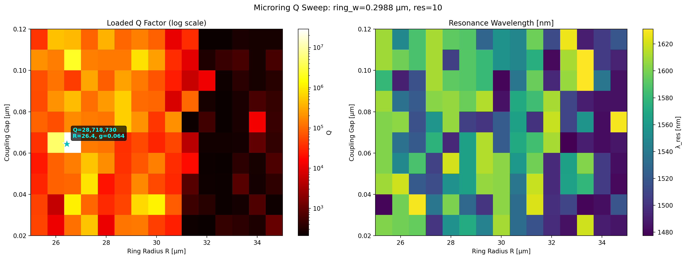
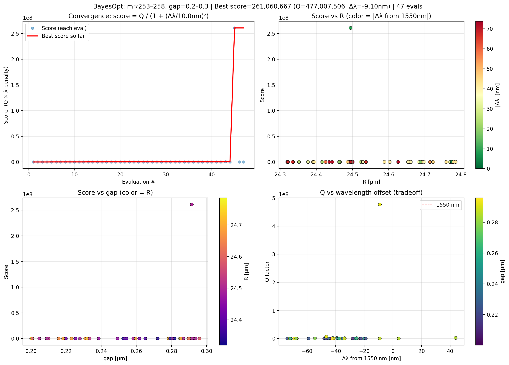
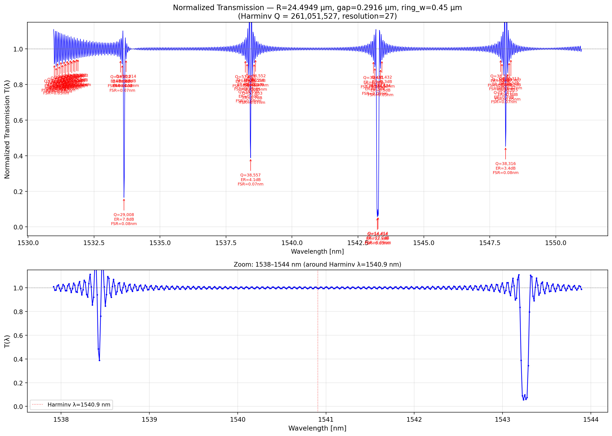
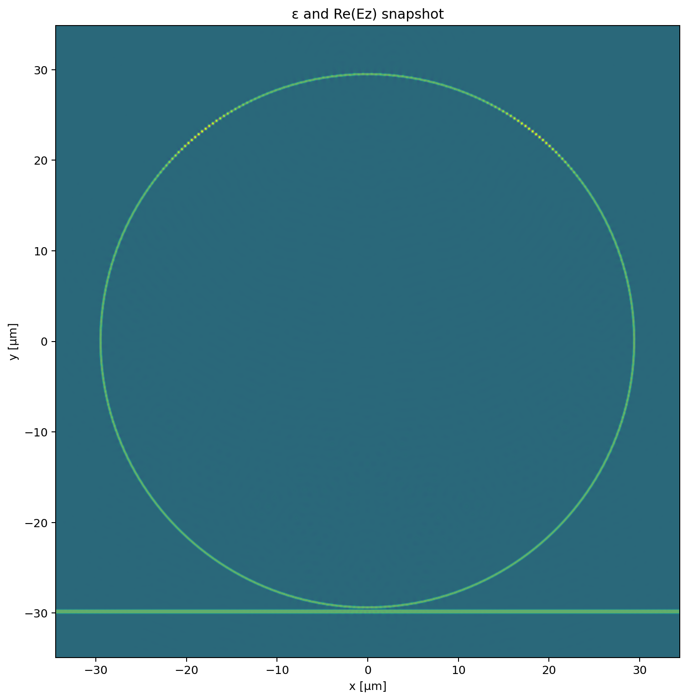

# photsims

A simple silicon photonic **microring resonator** (add/drop-style notch filter), designed and characterized end-to-end with MEEP — from a Bayesian search over geometry to Q-factor extraction and transmission spectra near 1550 nm.

## Overview

The device is a ring resonator coupled to a single bus waveguide, modeled in 2.5D using the effective-index method (`n_core ≈ 2.8217`, `n_clad = 1.44`, ring/waveguide width 0.45 µm). The goal was to find a ring radius and gap that place a high-Q resonance close to 1550 nm.

**Workflow:**
1. **Geometry search** — sweep ring radius/gap, then refine with Bayesian optimization (`bayesopt_24um.py`) to maximize Q near R ≈ 24 µm.
2. **Resonance characterization** — Harminv ringdown analysis to extract Q-factors and resonant wavelengths for candidate designs.
3. **Transmission spectra** — clean two-pass (reference vs. ring) flux normalization (`run_transmission_clean.py`) to get the notch-filter response without Fabry-Perot artifacts.
4. **Field visualization** — animate the Hz field circulating in the ring (`field_gif.py`).

### Q sweep over (R, gap)

### Bayesian optimization refinement near R ≈ 24 µm

### Transmission spectrum of the highest-Q design

There is some finite ringing due to time cutoff

### Field evolution in the ring

## SPSq/

- **`bayesopt_24um.py`** — Bayesian optimization (scikit-optimize GP) over ring radius and ring width near R ≈ 24 µm to maximize the resonator's Q-factor (via Harminv ringdown analysis). Logs results to CSV/PNG in `characterization_results/`.
- **`run_transmission_clean.py`** — Computes clean transmission spectra for selected ring designs using an EigenModeSource and a two-pass (reference vs. ring) flux normalization to remove Fabry-Perot artifacts. Currently configured for the "second highest Q" candidate (R = 24.7751 µm, gap = 0.2853 µm, Q ≈ 2.5e5 near λ = 1.5541 µm).
- **`field_gif.py`** — Generates a GIF of the Hz field evolution through the ring resonator at the m=140 mode candidate, for visualization.
- **`gdsklivehelp.py`** — WSL utility for streaming generated GDS layouts to KLayout (Klive plugin) on Windows for live layout viewing.
- **`characterization_results/`** / **`results/`** — Output data (CSVs, plots, GIFs) from the above scripts.

## OLD/

Earlier iterations of the design/optimization workflow, kept for reference:
- `designdscoupler/`, `sim/` — earlier directional-coupler/simulation setups.
- `imgresults/`, `results_bayesopt/` — earlier Bayesian optimization results and images.
